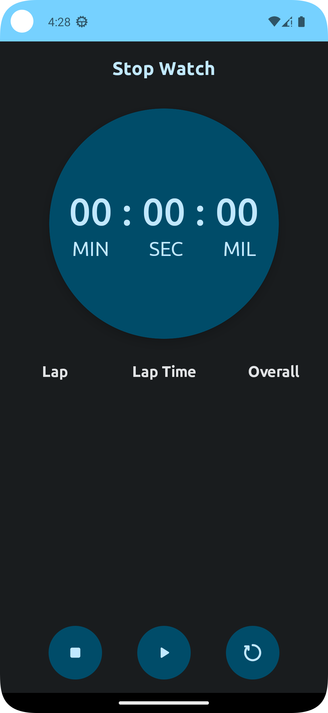
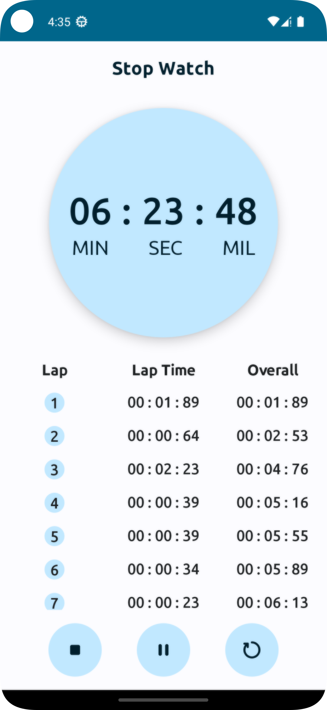

# Stopwatch App 🕒

Welcome to the Stopwatch App! This simple Android application, developed using Jetpack Compose, allows you to track time effortlessly. Whether you're timing your workouts, cooking, or any other activity, this stopwatch app has got you covered.

## Features 🌟

- Start, pause, and reset the stopwatch timer.
- Easy-to-read digital display.
- Precise timing down to milliseconds.
- User-friendly interface designed with Jetpack Compose.

## Screenshots 📸

Here are some screenshots from the Stopwatch App:

  
  

## Installation 🚀

To run this Stopwatch App on your Android device or emulator, follow these steps:

1. Clone the repository to your local machine:
   git clone https://github.com/ZeyadAbdullah679/StopWatch.git
   
2. Open the project in Android Studio.

3. Build and run the app on your device or emulator.

## Usage 💡

1. Tap the "Start" button to begin the stopwatch timer.
   
2. Tap the "Pause" button to pause the timer at any time.
   
3. To reset the stopwatch, tap the "Reset" button.

Enjoy tracking your time with the Stopwatch App! 🚀🕒
